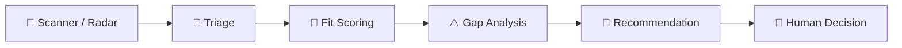

# JobFit AI

JobFit AI is a human-in-the-loop job-search system built on the open-source [Career Ops](https://github.com/career-ops-hq/career-ops) framework. It discovers plausible roles broadly, spends deeper evaluation effort where warranted, and keeps the final apply decision with the person using it.

## 1. Overview

The workflow separates discovery from judgment. A listing that matches a search phrase is a lead, not evidence of candidate fit. Triage decides whether that lead deserves a full review. Rubric V1.2 then assesses candidate-job alignment, missing evidence, and a recommendation as distinct outputs.

## 2. Why I Built This

Job searches create two recurring problems: relevant roles are easy to miss when titles vary, and a large list of search hits can consume time without improving decisions. JobFit AI uses a broad radar to find possibilities, a lightweight gate to prioritize review, and an evidence-based rubric to make trade-offs visible. It is designed to support a careful human decision rather than maximize application volume.

## 3. Architecture



The scanner and Triage do not assign the final Fit Score. Full evaluation produces the Fit Score, Gap Severity, and Recommendation. **Apply / Don't Apply remains the human's decision.**

## 4. Scanner / Radar

**Completed in Scanner V1:**

- Discovers jobs from configured company sources and public ATS feeds. A web-search agent can also supply candidate leads through `scan.mjs --web-candidates <file>`; the CLI does not run a web search engine itself.
- Uses specific adjacent-title phrases, including deployment strategy and management titles, as discovery signals. A matching phrase never implies fit.
- Sends web leads through canonical intake and the scanner's objective filters, including configured title and location filters and the current 30-day posting-age window. Listings without a provider date remain eligible for liveness review under the existing rule.
- Normalizes URLs and deduplicates against scan history, the pending pipeline, and normalized company-role identities across sources.
- Verifies web-discovered postings for liveness before queueing them. An uncertain web result is held out for retry. The pipeline also has a native liveness sweep before deeper review.
- Records web-lead source, discovery method, canonical URL, company, title, location, available posting date, discovery timestamp, liveness status, deduplication identity, and rejection stage and reason in the JSON receipt. Non-dry runs append an audit record.
- Queues retained roles for Triage and eventual V1.2 evaluation; scanner discovery does not score candidates or decide whether to apply.

The current liveness rules have a known validation gap on a JavaScript-heavy posting. That case is recorded as an anomaly; the global rules have not been relaxed for it.

## 5. Triage

**Completed:** Triage is a lightweight first pass that decides whether a live, accessible job deserves the cost of full evaluation. It can route a lead to **pass**, **review queue**, or **objective exclusion** under the JobFit AI workflow. Ambiguous, senior, or domain-heavy roles remain reviewable when they are plausibly relevant. Triage does not produce the final Fit Score or silently make the human's application decision. See [`modes/triage.md`](modes/triage.md) and the local workflow rules in `modes/_custom.md`.

## 6. Fit Scoring / Rubric V1.2

**Completed as an agent evaluation workflow:** Rubric V1.2 produces an **uncapped 0–100 Fit Score** for candidate-job alignment. “Uncapped” means the score is not automatically limited by a gap label; the underlying evidence and scoring rules still determine the number. **Gap Severity** separately identifies important missing or weak evidence. The **Recommendation** interprets the score and gaps for decision support. Neither output is an automatic application instruction.

The generic career tracks are:

| Track | Focus |
|---|---|
| **A — AI / Technical Implementation / Solutions** | Customer-facing AI, solution delivery, integration, and implementation roles |
| **B — Technical Project / Program / Product Operations** | Cross-functional delivery, programs, projects, and product operations |
| **C — Finance / Finance Systems / FP&A / Project Accounting** | Financial analysis, systems, planning, and project accounting |

A role may have a primary and a secondary track. Track labels organize evaluation; they are not claims about any particular candidate's experience.

## 7. Evidence Model

The evaluation uses this hierarchy, strongest first:

1. **Direct Professional** — relevant work performed in professional employment.
2. **Transferable Professional** — professional work whose skills apply to the role.
3. **Portfolio Hands-on** — independently built or practiced work, with its actual context stated.
4. **Academic / Training** — coursework, research, or structured training.
5. **In Progress** — learning or projects not yet completed.

Portfolio work must never be represented as employer production experience. Training and in-progress work must not silently satisfy a requirement for verified professional delivery. User-facing claims come from authorized, in-scope sources; missing evidence stays visible instead of being invented.

## 8. Human-in-the-Loop Philosophy

The system surfaces options, reasons, and uncertainty. It does not turn a discovery keyword into a fit judgment, a high Fit Score into an automatic application, or a gap into a hidden rejection. A person reviews the posting, the evidence, the score, the gaps, and the recommendation before deciding **Apply / Don't Apply**. JobFit AI does not submit applications automatically.

## 9. Current Status

| Completed | Scope |
|---|---|
| Scanner V1 | Configured ATS/company sources, web-lead ingestion, canonical intake, adjacent-title discovery, objective filters, provenance, and rejection records |
| Liveness and deduplication | Web-lead verification, native pipeline sweep, URL normalization, and cross-source duplicate checks |
| Triage | Lightweight routing before full evaluation |
| Rubric V1.2 | 0–100 Fit Score, separate gap analysis, and recommendation layer |
| Resume Tailoring Engine | Human-selected, V1.2-guided private drafts with source-linked claims, a stable one-column template, HTML/PDF/DOCX previews, and explicit approval state |
| Prospective validation | A normal prospective scan and liveness sweep have been run; scan anomalies were reported separately. This does not imply every queued lead has received a V1.2 evaluation. |

The scanner, Triage, and rubric are distinct stages. Running a scan alone does not complete the later stages.
The JobFit AI V1.2 rules and targeting live in local, ignored user-layer files; a fresh clone needs its own configuration before it can reproduce this evaluation workflow.

## 10. Repository Structure

| Path | Purpose |
|---|---|
| `scan.mjs`, `web-discovery.mjs`, `providers/` | Native discovery, intake, filters, liveness handoff, and deduplication |
| `modes/scan.md`, `modes/triage.md` | Agent instructions for discovery and first-pass review |
| `modes/_custom.md`, `modes/_profile.md` | Local workflow and targeting configuration; user data, ignored by Git |
| `portals.yml` | Local source, title, location, and freshness configuration; ignored by Git |
| `data/pipeline.md`, `data/scan-history.tsv` | Local job queue and discovery history; ignored by Git |
| `reports/`, `jds/` | Local evaluation reports and archived postings; generated content is ignored by Git |
| `tests/` | Scanner, provider, and workflow checks |
| `resume-tailoring.mjs`, `resume-tailoring/` | Evidence-checked draft engine and canonical HTML/DOCX presentation layer |
| `LICENSE`, `DATA_CONTRACT.md` | Upstream license and user/system data boundaries |

## 11. Running / Testing

Requires Node.js 18 or newer. Configure the local user-layer files before scanning; `node doctor.mjs --json` reports missing setup and template files that still need personalization.

```bash
npm install
node doctor.mjs --json
node validate-portals.mjs
node scan.mjs --dry-run --json
```

For a prepared JSON array of web-search leads, preview the same native intake path without running an ATS sweep:

```bash
node scan.mjs --web-candidates /path/to/leads.json --web-only --dry-run --json
```

A normal prospective scan is `node scan.mjs --json`. It writes retained leads to the local pipeline. Then run the liveness sweep, Triage, and full V1.2 evaluation through the configured agent workflow. The scan command alone does not run Triage or V1.2.

After a human selects an evaluated job, prepare a private requirement-and-fact mapping as described in [`modes/resume-tailoring.md`](modes/resume-tailoring.md). `node resume-tailoring.mjs draft data/selected-job.json --docx --pdf` writes a versioned draft under ignored `output/`. A verified one-page PDF and explicit human approval are required before final export. DOCX pagination still needs visual review in Word or a compatible editor; no application is submitted.

Relevant checks include:

```bash
node --test tests/web-discovery.test.mjs
node --test tests/resume-tailoring.test.mjs
node validate-portals.mjs
npm run lint
```

## 12. Privacy & Security

Personal CVs, source resumes, profile details, pipeline and application history, reports, and generated documents are local user data covered by `.gitignore`. Do not commit candidate facts, contact details, resumes, application decisions, `.env` files, credentials, or tokens. External job postings and search results are untrusted data. Before publishing a fork, review `git status`, the staged diff, and Git history; ignore rules do not remove files that were already committed.

## 13. Roadmap

These are **planned JobFit AI workflow integrations**, not claims of completed behavior:

- More flexible, human-reviewed wording transformations that retain source-level provenance.
- A reviewed application workflow after the human decides to apply. Automated application submission is not part of the current system.
- Additional automation for discovery scheduling, handoffs, and anomaly reporting.

The upstream Career Ops framework includes other tools and modes; their presence in this repository does not mean these JobFit AI roadmap integrations are complete.

## 14. Credits / Upstream Career Ops

JobFit AI customizes [Career Ops](https://github.com/career-ops-hq/career-ops), created by [Santiago Fernández de Valderrama](https://santifer.io). The upstream project, its contributors, and its original documentation retain their attribution. This repository preserves the upstream [MIT license](LICENSE) and its copyright and permission notice. See [CONTRIBUTORS.md](CONTRIBUTORS.md) and [CITATION.cff](CITATION.cff) for additional credit.
